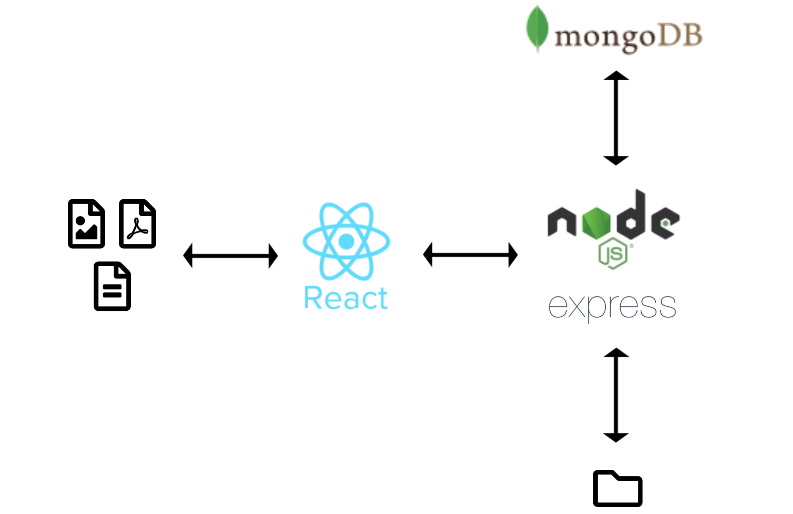

## File archive

**Requirements**: 

Docker (and Docker Compose)

The app was build using React in the client side and Node.js, Express, and MongoDB in the server side. Uploaded files are stored in a server folder and their metadata is stored in a database collection.

**App flow**



To run the app execute the following command in the application root folder:

```bash
docker-compose -f docker-compose.prod.yml up
```

For the development version run:

```bash
docker-compose up
```

The application is served to `http://localhost:3000/`
